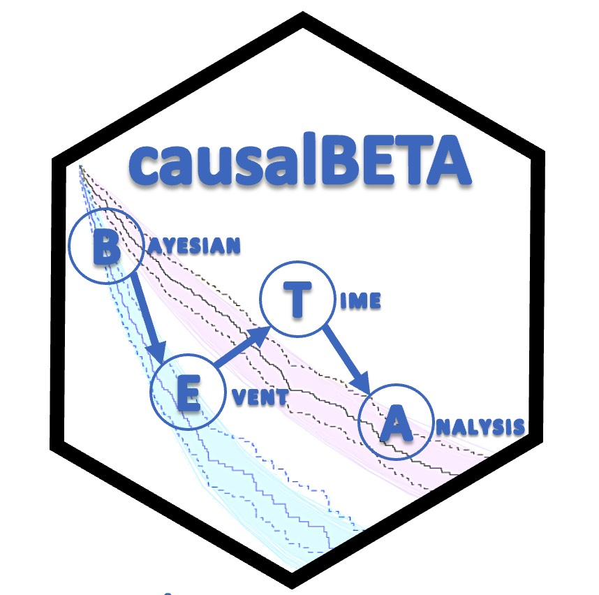

# causalBETA <a href="url"></a>
The paper associated with this package is on arXiv: https://arxiv.org/abs/2310.12358.
<br/>
<br/>
<br/>
# About
The R package `causalBETA` is an MCMC-based implementation of piecewise exponential model for survival data, and it uses G-computation to conduct causal inference for binary treatment on survival data. We provide generic plot functions to visualize estimates easily and allow users to run MCMC diagnostics by `coda` package.

# Installation
install using `devtools` package
```
## install.packages(devtools) ## make sure to have devtools installed 
devtools::install_github("RuBBiT-hj/causalBETA")
library(causalBETA)
```

## Dependency

The following packages are required for `causalBETA`:

* `cmdstanr` ≥ 0.5.3
* `coda` ≥ 0.19-4
* `mets` ≥ 1.3.2
* `survival` ≥ 3.5-5
* `LaplacesDemon` ≥ 16.1.6

This information is also listed in `DESCRIPTION`.

# Documentation and Examples
[The paper](https://arxiv.org/abs/2310.12358) associated with this package contains the statistical details of the model as well as a detailed walk-through demonstration.

Help documentation in R is also available, and it has example code for each function. After installing the package and loading it with `library(causalBETA)`, use `?` to access help documentation for specific functions. For example, for the two main functions:
```
?causalBETA::bayeshaz     # Construct the MCMC-based Bayesian piece-wise exponential model
?causalBETA::bayesgcomp   # Apply G-computation to obtain posterior draws of the average difference in survial probabilities between two treatments
```

The code for demostration in the paper is available in the folder [demo_code](https://github.com/RuBBiT-hj/causalBETA/tree/main/demo_code).


# Reporting Issues
If you encounter any bugs or have feature requests, please [open an issue](https://github.com/RuBBiT-hj/causalBETA/issues) on GitHub.

# Citation
Please use the following LaTex cite as follows:
```
@misc{ji2023causalbeta,
      title={causalBETA: An R Package for Bayesian Semiparametric Causal Inference with Event-Time Outcomes}, 
      author={Han Ji and Arman Oganisian},
      year={2023},
      eprint={2310.12358},
      archivePrefix={arXiv},
      primaryClass={stat.ME}
}
```

# Contact
The corresponding package author are Han Ji (email: han_ji@brown.edu) and Arman Oganisian (email: arman_oganisian@brown.edu).
